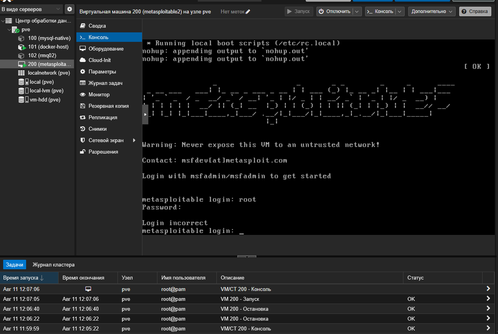
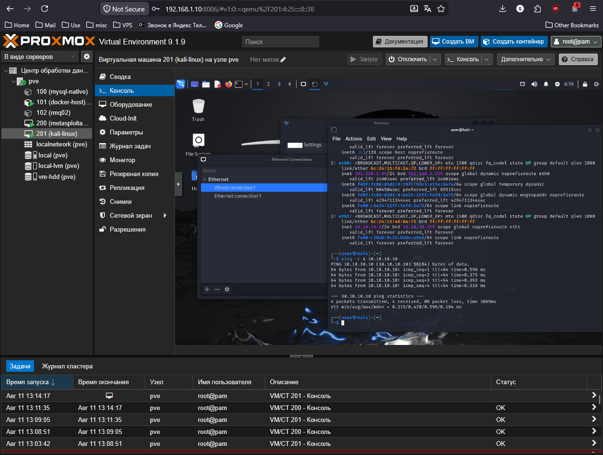
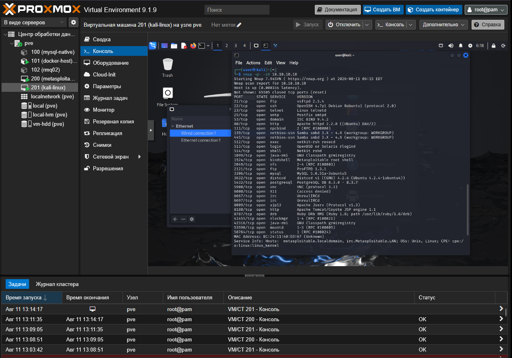
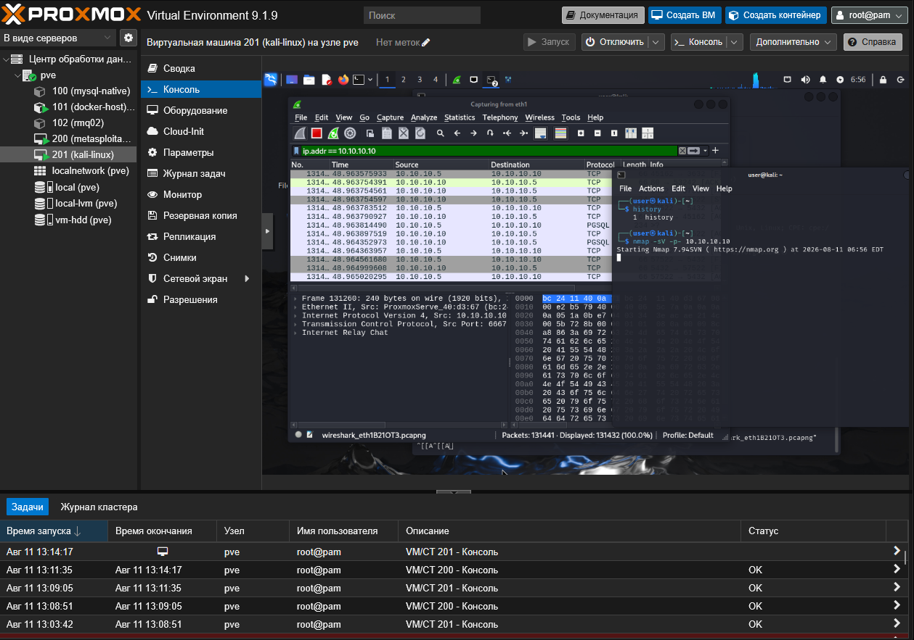

# Домашнее задание к занятию «Уязвимости и атаки на информационные системы»

**Студент:** Христофоров Константин

# Задание 1

Скачайте и установите виртуальную машину Metasploitable: https://sourceforge.net/projects/metasploitable/.

Это типовая ОС для экспериментов в области информационной безопасности, с которой следует начать при анализе уязвимостей.

Просканируйте эту виртуальную машину, используя nmap.

Попробуйте найти уязвимости, которым подвержена эта виртуальная машина.

Сами уязвимости можно поискать на сайте https://www.exploit-db.com/.

Для этого нужно в поиске ввести название сетевой службы, обнаруженной на атакуемой машине, и выбрать подходящие по версии уязвимости.

**Ответьте на следующие вопросы:**

*    Какие сетевые службы в ней разрешены?
*    Какие уязвимости были вами обнаружены? (список со ссылками: достаточно трёх уязвимостей)

**Приведите ответ в свободной форме.**

---

### Задание 1. Сканирование и поиск уязвимостей Metasploitable

** В ходе выполнения лабораторной работы виртуальные машины с Kali Linux и Metasploitable 2 была успешно развернута на хосте с ProxMox VE, создан изолированный сегмент сети и Metasploitable просканирована с помощью утилиты `nmap`. **



---

#### 1.Какие сетевые службы в ней разрешены?

```bash
nmap -p- -sV 10.10.10.10
```
---

**По результатам сканирования обнаружены следующие ключевые открытые порты и активные сетевые службы:**

*-Port 21/TCP — FTP (служба: vsftpd 2.3.4)
*-Port 22/TCP — SSH (служба: OpenSSH 4.7p1)
*-Port 23/TCP — Telnet (служба: Linux telnetd)
*-Port 25/TCP — SMTP (служба: Postfix smtpd)
*-Port 80/TCP — HTTP (служба: Apache httpd 2.2.8)
*-Port 139/445/TCP — SMB (служба: Samba 3.0.20-Debian)
*-Port 5432/TCP — PostgreSQL (служба: PostgreSQL DB 8.3.0)
*-Port 6667/TCP — IRC (служба: UnrealIRCd 3.2.8.1)
*-Port 8180/TCP — HTTP (служба: Apache Tomcat/Coyote 5.5)


---

#### 2. Какие уязвимости были вами обнаружены?

**Вот 3 примера критических уязвимостей которые нам удалось обнаружить**

*[vsftpd 2.3.4 - Backdoor Command Execution](https://www.exploit-db.com/exploits/49757)
*[Samba 3.0.20 < 3.0.25rc3 - 'Username' map script' Command Execution (Metasploit)](https://www.exploit-db.com/exploits/16320)
*[UnrealIRCd 3.2.8.1 - Local Configuration Stack Overflow](https://www.exploit-db.com/exploits/18011)

---

# Задание 2

Проведите сканирование Metasploitable в режимах SYN, FIN, Xmas, UDP.

Запишите сеансы сканирования в Wireshark.

**Ответьте на следующие вопросы:**

*    Чем отличаются эти режимы сканирования с точки зрения сетевого трафика?
*    Как отвечает сервер?

**Приведите ответ в свободной форме.**

---

#### 1. Команды для запуска сканирования в Kali Linux

*Каждый режим запускался из терминала атакующей машины с указанием конкретного флага:

```bash
# SYN
nmap -sS -p 21,22,80 10.10.10.10

# FIN
nmap -sF -p 21,22,80 10.10.10.10

# Xmas
nmap -sX -p 21,22,80 10.10.10.10

# UDP
nmap -sU -p 53,111,137 10.10.10.10
```


### Чем отличаются режимы сканирования с точки зрения сетевого трафика?
Главное отличие — это то, какие именно пакеты и с какими флагами отправляет Kali Linux

*При SYN-сканировании Kali отправляет стандартный, правильный запрос на начало соединения (флаг SYN). Это как вежливый стук в дверь по всем правилам сети.
**Если порт открыт, сервер радостно отвечает пакетом SYN-ACK (готов общаться). Но Kali тут же обрывает его пакетом RST (сброс), чтобы не открывать полноценную сессию. Если порт закрыт, сервер сразу присылает RST.**

*При FIN-сканировании Kali шлет странный пакет с флагом FIN (запрос на закрытие связи), хотя никакого соединения до этого вообще не открывалось. Это нарушение сетевой логики.

*При Xmas-сканировании Kali отправляет аномальный пакет, где одновременно включены три флага — FIN, PSH и URG. Пакет назвали «новогодней елкой», потому что в анализаторе трафика он горит всеми индикаторами флагов сразу.
**Если порт открыт, сервер вообще молчит. Сетевой стек Linux устроен так: если порт занят реальной службой, он просто проигнорирует и выбросит эти кривые пакеты (FIN или Xmas) без ответа. Nmap видит это молчание и понимает, что порт открыт.Если порт закрыт, сервер отправляет пакет RST.**

*При UDP-сканировании трафик вообще другой — пакеты идут не по протоколу TCP, а по UDP. Там нет никаких флагов и предварительных приветствий, Kali просто шлет пустой кусок данных на конкретный порт.
**Если порт открыт, сервер либо молчит, либо служба присылает свой внутренний ответ (если мы угадали с форматом данных).Если порт закрыт, сервер выдает системную ошибку через протокол ICMP — приходит пакет ICMP Destination Unreachable (Хост недоступен / Порт недоступен).**

